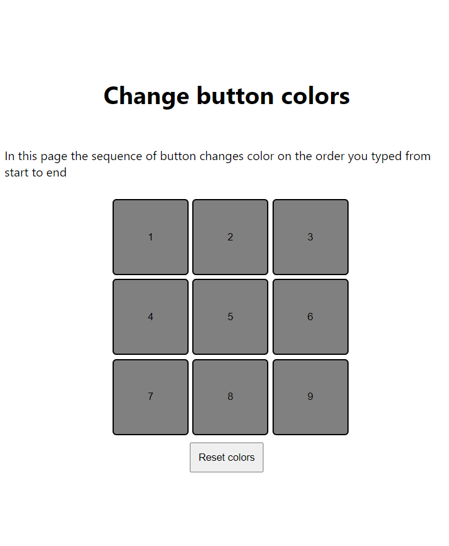
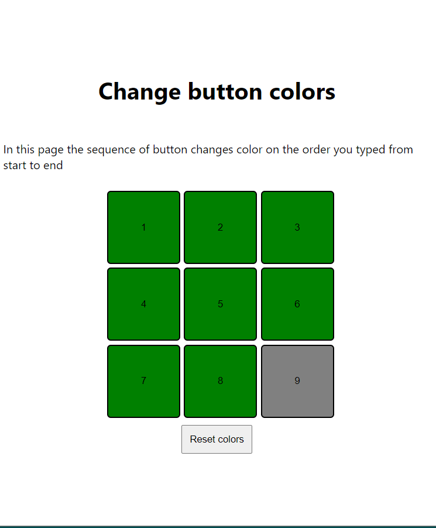
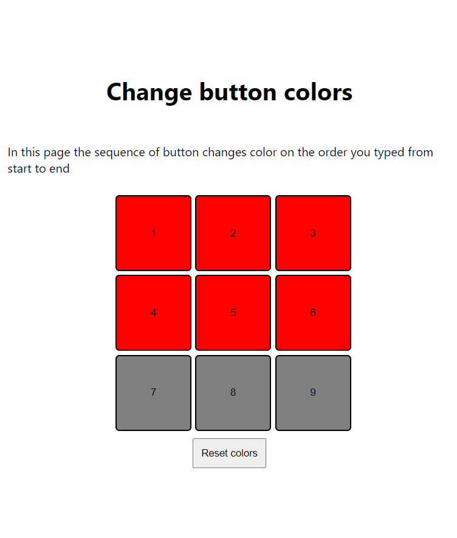

# Button Color Change
## The goal of this project is to create an application in which the color of button changes on click and reset in the order we clicked the button

## The color changes to green using on click event

## The color of the buttons turns green after 1second of time in the order we clicked.
